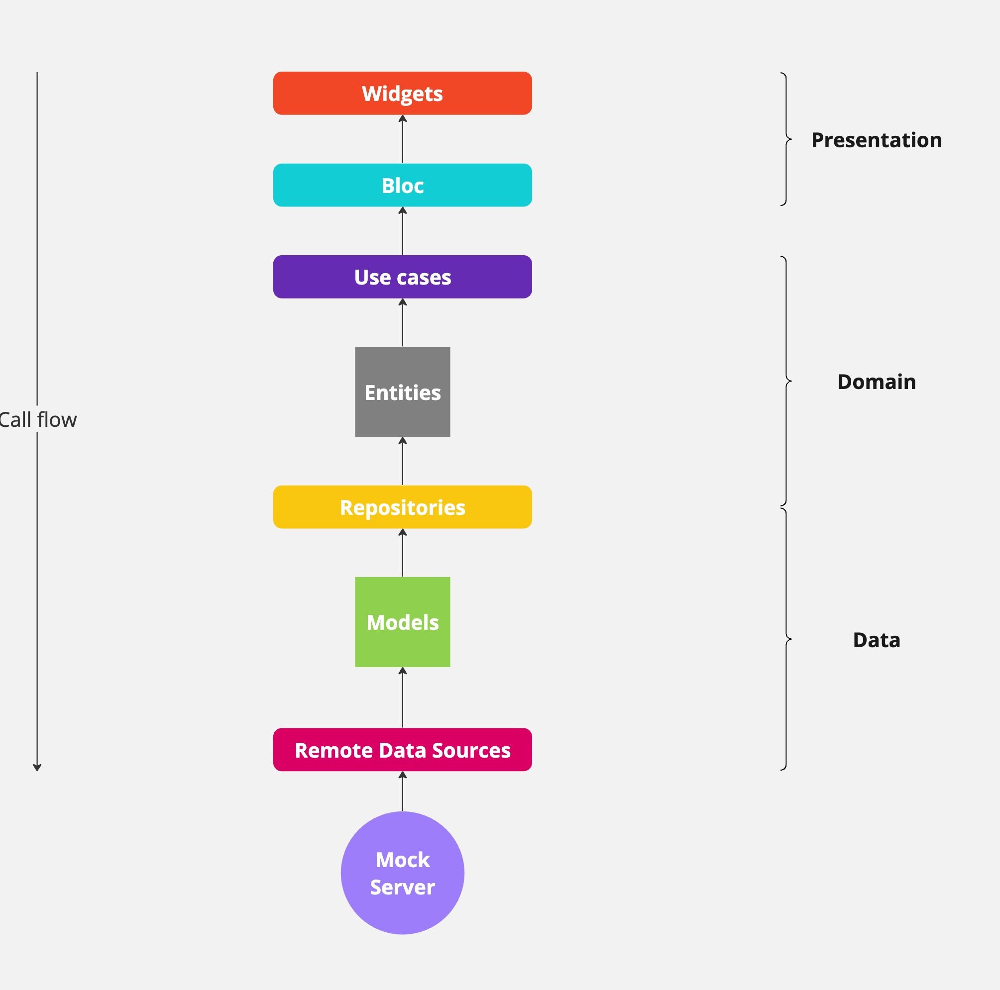

# Credit card validator
The main goal for creating this project was to implement a card validator using Clean Architecture & TDD. An equally important task was to create a server mock that would enable the use of the application without a backend.

## Launch Instructions

### Launch Configurations
As part of the task, launch configurations have been prepared to enable the application to be run using an IDE. Configurations for <b>VSCode</b> and <b>AndroidStudio</b> are available respectively in the `.vscode/launch.json` file and in the `.run`folder. To launch the application, select the Development configuration.

### Launching via Command
To start the application, run the following command:
```sh
flutter run --dart-define-from-file=env/dev.json
```

## Environments
The application has been adapted to handle multiple environments. Sample data used during the build process for both development and production environments are placed in the `env/` directory.

### Development Environment
To start the application in the development environment, use the following command:

```sh
flutter run --dart-define-from-file=env/dev.json
```

The development environment allows the application to run without a server. An `Interceptor` available in the `lib/src/core/debug/` directory handles requests, loading responses from the path `assets/json/<endpoint_name>/<method>.json`. The Interceptor allows changing the time and response code that the server (mock) will return.

## Production Environment
To start the application in the production environment, use the following command:

```sh
flutter run --dart-define-from-file=env/prod.json --release
```

Data for the production environment is provided solely for testing and demonstration purposes.

## Tests

### Unit Tests
To run unit tests, use the following command:

```sh
flutter test
```

### Integration Tests
To run integration tests, use the following command:

```sh
flutter test integration_test
```

## Architecture
The architecture of the mobile application is presented in the diagram below:



### Project File Structure
* `assets/`
  * `images` - directory for images.
  * `json/<nazwa_endpointu>/` - directories for storing server mock responses.
* `env` - directory with information about the environments used by the application.
* `integration_test/` - directory for integration tests.
* `lib/`
  * `l10n/` - directory for translations of the texts available in the application.
  * `src/`
    * `core/` - directory with source code used throughout the application.
      * `debug/` - directory with tools useful for debugging the application.
      * `errors/` - directory related to errors handled by the application.
      * `presentation/` - directory with main screens and widgets of the application.
      * `usecases/` - directory with the use case interface.
    * `features/`
      * `card_validation/` - directory with source code for the `card validation` feature.
    * `app.dart` - main widget of the application.
    * `injection_container.dart` - file where dependencies are injected.
  * `main.dart`
